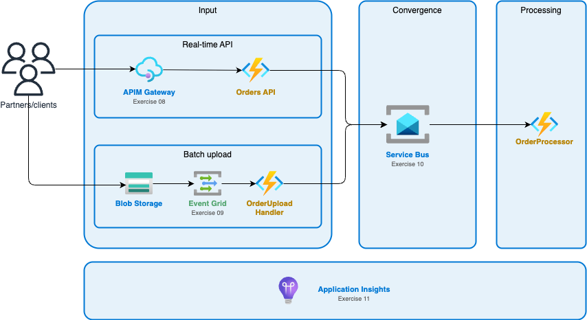

# CloudShop Order Pipeline

[](https://learn.microsoft.com/en-us/certifications/exams/az-204)
[](docs/index.md)

Hands-on exercises for **AZ-204 Day 4** - building an e-commerce order processing pipeline with Azure's messaging and integration services.

## The Story

**CloudShop** is modernizing their order processing to handle:
- Partner API integrations
- Batch file uploads
- Real-time website analytics
- Reliable order processing

You'll build this system step-by-step, learning Azure services along the way.

## Architecture

Partners submit orders through two channels that converge at Service Bus:



## Exercises

| Folder | Module | Topic |
|--------|--------|-------|
| [08-api-management](exercises/08-api-management/) | 08 | API Management Gateway |
| [09-event-grid](exercises/09-event-grid/) | 09 | Event Grid |
| [10-service-bus](exercises/10-service-bus/) | 10 | Service Bus |
| [11-app-insights](exercises/11-app-insights/) | 11 | Application Insights |

## Quick Start

```bash
# Clone and navigate
git clone https://github.com/pjrellum/az-204-exercises-cloudshop.git
cd az-204-exercises-cloudshop

# Login to Azure
az login

# Start with Module 08
cd exercises/08-api-management
cat README.md
```

## Prerequisites

- Azure subscription ([free trial](https://azure.microsoft.com/free/))
- [Pre-configured Codespace](https://codespaces.new/pjrellum/AZ-204-codespace) (recommended), or install locally:
  - Azure CLI 2.50+
  - .NET 8 SDK
  - VS Code with Azure extensions

## Documentation

- [Getting Started](docs/getting-started.md) - Prerequisites and setup

## Cleanup

```bash
./scripts/cleanup.sh
```

Estimated cost: ~$5-10 (using Consumption tiers)

## License

MIT - See [LICENSE](LICENSE)
