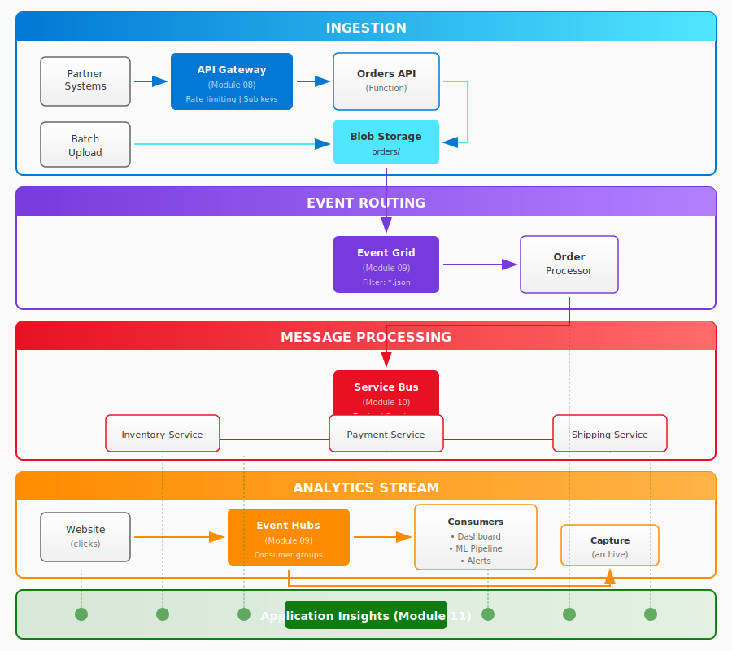
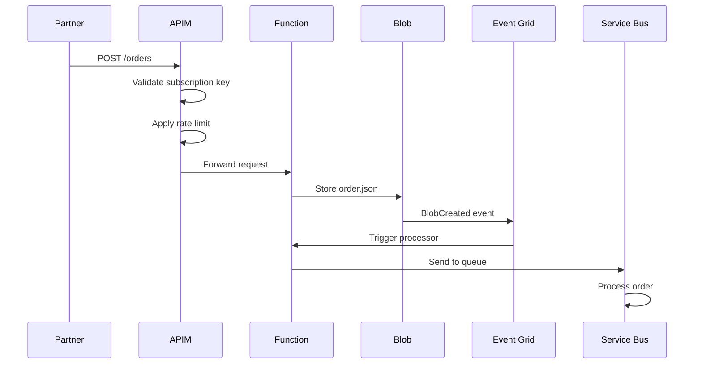
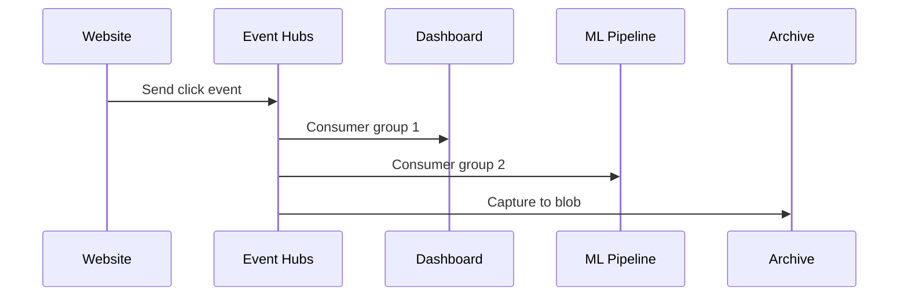

# Architecture Deep Dive

This page explains the design decisions behind the CloudShop Order Pipeline.

## High-Level Overview

CloudShop is a fictional e-commerce platform that processes orders through multiple channels:

1. **API Channel** - Partners submit orders via REST API
2. **Batch Channel** - Bulk orders uploaded as JSON files
3. **Analytics Stream** - Website events for real-time insights

## Component Architecture



## Design Decisions

### Why API Management?

| Requirement | Solution |
|-------------|----------|
| Partner authentication | Subscription keys per partner |
| Rate limiting | Policies prevent abuse |
| API versioning | URL path versioning |
| Analytics | Built-in usage metrics |

**Alternative considered:** Azure Front Door - but lacks API-specific features like policies.

### Why Event Grid for Blob Events?

| Requirement | Solution |
|-------------|----------|
| React to blob uploads | Native blob storage integration |
| Filter by file type | Subject filtering (*.json) |
| Reliable delivery | Built-in retry with dead-letter |
| Low latency | Near real-time event delivery |

**Alternative considered:** Blob trigger in Azure Functions - less control over filtering and dead-letter.

### Why Event Hubs for Analytics?

| Requirement | Solution |
|-------------|----------|
| High throughput | Millions of events/second |
| Multiple consumers | Consumer groups for parallelism |
| Historical replay | Time-based retention |
| Archival | Capture to blob storage |

**Alternative considered:** Event Grid - not designed for high-volume streaming.

### Why Service Bus for Order Processing?

| Requirement | Solution |
|-------------|----------|
| Guaranteed delivery | At-least-once semantics |
| Order processing | FIFO with sessions |
| Multiple handlers | Topics with subscriptions |
| Dead-letter | Built-in DLQ |

**Alternative considered:** Queue Storage - lacks topics, sessions, and advanced features.

## Message Flow

### Order Submission (API Channel)



### Analytics Stream



## Resource Naming

All resources follow this naming convention:

```
{resource-type}-cloudshop-{component}-{environment}
```

Examples:
- `apim-cloudshop-gateway-dev`
- `evhns-cloudshop-analytics-dev`
- `sb-cloudshop-orders-dev`
- `st-cloudshop-orders-dev` (storage, no hyphens)

## Security Considerations

| Layer | Security Control |
|-------|------------------|
| API Gateway | Subscription keys, IP filtering |
| Storage | SAS tokens, managed identity |
| Event Grid | Webhook validation, RBAC |
| Event Hubs | Shared access policies, managed identity |
| Service Bus | Shared access policies, managed identity |
| Monitoring | RBAC, data retention policies |

## Cost Optimization

| Service | Tier | Why |
|---------|------|-----|
| API Management | Consumption | Pay-per-call, no idle cost |
| Event Hubs | Standard | Capture requires Standard+ |
| Service Bus | Standard | Topics require Standard+ |
| Storage | Standard LRS | Sufficient for workshop |
| App Insights | Pay-as-you-go | Minimal cost for low volume |

**Estimated cost:** ~$5-10 for completing the workshop (assuming cleanup after).

## Exercise-Specific Diagrams

Each exercise includes its own context and goal diagrams:

| Exercise | Context Diagram | Goal Diagram |
|----------|-----------------|--------------|
| 08 - API Management | Where APIM fits in the pipeline | What you'll build |
| 09a - Event Grid | Blob → Event Grid → Function flow | Subscription with filters |
| 09b - Event Hubs | Website → Event Hubs → Consumers | Namespace with partitions |
| 10 - Service Bus | Event Grid → Service Bus → Workers | Queue with dead-letter |
| 11 - Application Insights | All services connected | Monitoring dashboard |

These diagrams are located in each exercise's `images/` folder and shown in the exercise README.
