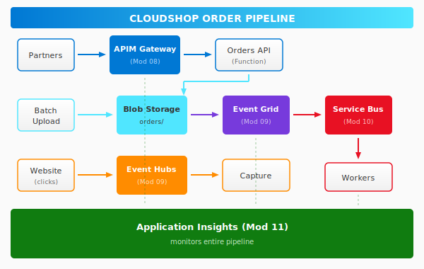

# CloudShop Order Pipeline

A hands-on workshop for **AZ-204 Day 4** covering API Management, Events, Messaging, and Monitoring.

## The Story

**CloudShop** is a growing e-commerce company. They need to modernize their order processing system to handle:

- **Partner integrations** - External systems submitting orders via API
- **Batch uploads** - Large order files dropped into storage
- **Real-time analytics** - Website clickstream for recommendations
- **Reliable processing** - Orders must never be lost

You'll build this system piece by piece, learning Azure's integration services along the way.

## Target Architecture

## Exercises

Each exercise maps to a Day 4 module:

| Exercise | Module | Service | What You'll Build |
|----------|--------|---------|-------------------|
| [08-api-management]({{ exercises_url }}/08-api-management) | 08 | API Management | Secure API gateway with rate limiting |
| [09a-event-grid]({{ exercises_url }}/09a-event-grid) | 09 | Event Grid | React to blob uploads automatically |
| [09b-event-hubs]({{ exercises_url }}/09b-event-hubs) | 09 | Event Hubs | Stream analytics with capture |
| [10-service-bus]({{ exercises_url }}/10-service-bus) | 10 | Service Bus | Reliable message processing |
| [11-app-insights]({{ exercises_url }}/11-app-insights) | 11 | Application Insights | End-to-end monitoring |

## Time Estimates

| Exercise | Core Lab | Challenge | Total |
|----------|----------|-----------|-------|
| 08 - API Management | 30 min | 15 min | 45 min |
| 09a - Event Grid | 25 min | 15 min | 40 min |
| 09b - Event Hubs | 30 min | 20 min | 50 min |
| 10 - Service Bus | 30 min | 20 min | 50 min |
| 11 - App Insights | 25 min | 20 min | 45 min |
| **Total** | **2h 20m** | **1h 30m** | **~4 hours** |

## Next Steps

- [Getting Started](getting-started.md) - Prerequisites and setup
- [Architecture](architecture.md) - Deep dive into the design
- [Troubleshooting](troubleshooting.md) - Common issues
