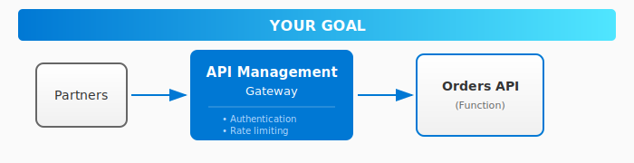
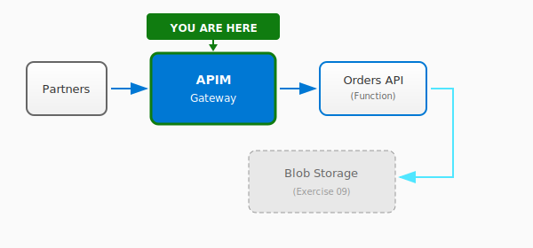

# Exercise 08: API Management Gateway

## Overview

In this exercise, you'll create the **API gateway** for CloudShop's order processing pipeline. Partners will use this gateway to submit orders programmatically through a secure, rate-limited API.

**Time:** 30-45 minutes (+ 15-20 minutes for challenges)

## What You'll Build



By the end, you'll have:
- An Azure Function serving as the Orders API backend
- An API Management instance as the gateway
- Subscription key authentication configured
- (Challenge) Rate limiting policies applied

## Architecture Context

This is the entry point for the CloudShop pipeline:



## Choose Your Path

### Infrastructure Approach

| Approach | Best For | Folder |
|----------|----------|--------|
| **Azure CLI** | Quick iteration, learning commands | [infrastructure/azure-cli/](infrastructure/azure-cli/) |
| **Bicep** | Infrastructure as Code, repeatable deployments | [infrastructure/bicep/](infrastructure/bicep/) |

### Code Language

| Language | Runtime | Folder |
|----------|---------|--------|
| **.NET** | .NET 8 (isolated) | [code/dotnet/](code/dotnet/) |

> **Tip:** Each folder has `starter/` (templates with TODOs) and `complete/` (full solutions)

## Getting Started

### 1. Set Up Your Environment

```bash
# Copy and configure your environment variables
cp env.example.sh env.sh
# Edit env.sh with your unique suffix (e.g., your initials + random: "pm42")
```

### 2. Follow the Instructions

**Start here:** [instructions/](instructions/)

The instructions tell you **what** to build. When you need help with **how**, check:
- The expandable hints in each instruction file
- The `starter/` folders for templates
- The `complete/` folders for full solutions

### 3. Validate Your Work

```bash
# Check if everything is set up correctly
./validate/check-all.sh
```

## Quick Reference

| What | Where |
|------|-------|
| Step-by-step guide | [instructions/](instructions/) |
| Azure CLI scripts | [infrastructure/azure-cli/](infrastructure/azure-cli/) |
| Bicep templates | [infrastructure/bicep/](infrastructure/bicep/) |
| Function code | [code/](code/) |
| Test your API | [test/](test/) |
| Validation scripts | [validate/](validate/) |
| One-click deploy | [quickstart/](quickstart/) |

## Challenges

Challenges are integrated into the instructions. Look for **[Challenge]** sections:

- **[Challenge] Rate Limiting:** Add a policy to limit calls to 10 per minute
- **[Challenge] Custom Errors:** Return friendly JSON error messages
- **[Challenge] Request Validation:** Validate order JSON schema

## Next Exercise

Once validated, continue to [Exercise 09a: Event Grid](../09a-event-grid/) where you'll configure automatic processing when orders arrive.

---

## Troubleshooting

<details>
<summary>APIM takes too long to create</summary>

The Consumption tier typically creates in 2-3 minutes. Other tiers (Developer, Basic, Standard) take 30-45 minutes. Make sure you're using Consumption tier for this exercise.

</details>

<details>
<summary>Function deployment fails</summary>

1. Ensure you're logged in: `az login`
2. Check the Function App exists: `az functionapp show --name $FUNCTION_APP --resource-group $RESOURCE_GROUP`
3. For .NET, ensure you've built first: `dotnet build`

</details>

<details>
<summary>API returns 401 even with subscription key</summary>

1. Check the header name is exactly `Ocp-Apim-Subscription-Key`
2. Ensure no extra spaces in the key
3. Verify the subscription is active in the portal

</details>
