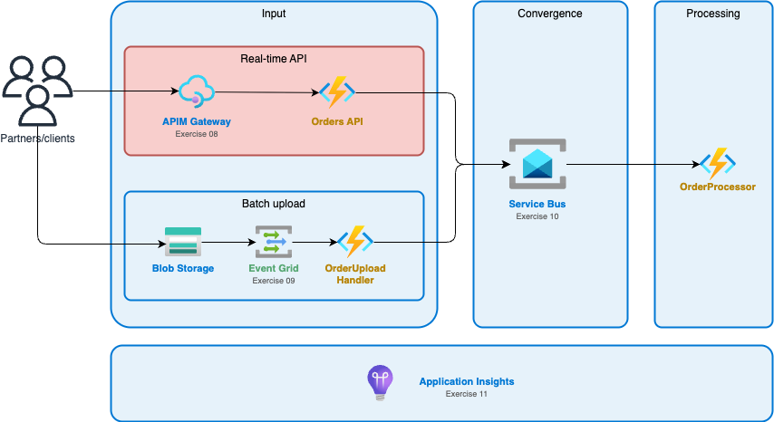

# Exercise 08: API Management Gateway

## Architecture



*You are here: Building the **APIM Gateway** and **Orders API** - the real-time entry point for partner orders.*

## What You'll Build

- **Azure Function** - Orders API backend that accepts and stores orders
- **API Management** - Gateway with subscription key authentication
- **APIM Operations** - GET /orders, POST /orders, GET /health

## Choose Your Path

| Path | Description |
|------|-------------|
| **Learning** | Work through steps below, using guided scripts |
| **Quick Deploy** | Run `./quickstart/deploy-all.sh` |

## Learning Path

### Step 1: Configure Environment

```bash
cp env.example.sh env.sh
nano env.sh  # Set UNIQUE_SUFFIX (e.g., your initials + random: "pm42")
source env.sh
```

### Step 2: Deploy Infrastructure

Open [`infrastructure/azure-cli/guided/deploy.sh`](infrastructure/azure-cli/guided/deploy.sh) and work through Steps 1-4:

| Step | What You'll Create | Key Concept |
|------|-------------------|-------------|
| 1 | Resource Group | Resource organization |
| 2 | Storage Account | Required for Function App |
| 3 | Function App | Serverless compute |
| 4 | API Management | Gateway (Consumption tier) |

Fill in the `???` placeholders, uncomment each section, and run the script.

### Step 3: Deploy Function Code

```bash
cd code/dotnet
./deploy.sh
```

### Step 4: Create API in APIM

```bash
# Create the API
az apim api create \
    --resource-group $RESOURCE_GROUP \
    --service-name $APIM_NAME \
    --api-id orders-api \
    --path orders \
    --display-name "Orders API" \
    --service-url "https://${FUNC_NAME}.azurewebsites.net/api"

# Add operations
az apim api operation create \
    --resource-group $RESOURCE_GROUP \
    --service-name $APIM_NAME \
    --api-id orders-api \
    --operation-id get-orders \
    --display-name "Get Orders" \
    --method GET \
    --url-template "/orders"

az apim api operation create \
    --resource-group $RESOURCE_GROUP \
    --service-name $APIM_NAME \
    --api-id orders-api \
    --operation-id create-order \
    --display-name "Create Order" \
    --method POST \
    --url-template "/orders"

az apim api operation create \
    --resource-group $RESOURCE_GROUP \
    --service-name $APIM_NAME \
    --api-id orders-api \
    --operation-id health-check \
    --display-name "Health Check" \
    --method GET \
    --url-template "/health"
```

### Step 5: Test the API

```bash
# Get subscription key
APIM_KEY=$(az apim subscription keys list \
    --resource-group $RESOURCE_GROUP \
    --service-name $APIM_NAME \
    --subscription-id master \
    --query primaryKey -o tsv)

# Test health endpoint
curl -H "Ocp-Apim-Subscription-Key: $APIM_KEY" \
    "https://${APIM_NAME}.azure-api.net/orders/health"
```

## Validation

```bash
./validate/check-all.sh
```

## Next Exercise

Continue to [Exercise 09: Event Grid](../09-event-grid/) for event-driven batch processing.

---

## Why API Management?

| Requirement | How APIM Solves It |
|-------------|-------------------|
| Partner authentication | Subscription keys per partner |
| Rate limiting | Policies prevent abuse |
| API versioning | URL path versioning |
| Analytics | Built-in usage metrics |

---

## Troubleshooting

<details>
<summary>APIM takes too long to create</summary>

The Consumption tier typically creates in 2-3 minutes. Other tiers take 30-45 minutes. Make sure you're using Consumption tier.

</details>

<details>
<summary>Function deployment fails</summary>

1. Ensure you're logged in: `az login`
2. Check the Function App exists: `az functionapp show --name $FUNC_NAME --resource-group $RESOURCE_GROUP`
3. For .NET, ensure you've built first: `dotnet build`

</details>

<details>
<summary>API returns 401 even with subscription key</summary>

1. Check the header name is exactly `Ocp-Apim-Subscription-Key`
2. Ensure no extra spaces in the key
3. Verify the subscription is active in the portal

</details>
