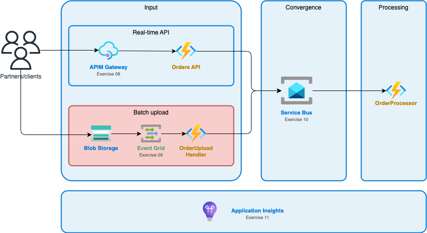

# Exercise 09: Event Grid

## Architecture



*You are here: Building the **Event Grid** subscription - enabling batch order uploads via blob storage.*

## What You'll Build

- **Storage Containers** - `orders/` for uploads, `deadletter/` for failed events
- **Event Grid Subscription** - Triggers on BlobCreated events
- **Azure Function** - OrderUploadHandler that processes batch files

## Prerequisites

Complete [Exercise 08](../08-api-management/) first - you need the Function App and Storage Account.

## Choose Your Path

| Path | Description |
|------|-------------|
| **Learning** | Work through steps below, using guided scripts |
| **Quick Deploy** | Run `./quickstart/deploy-all.sh` |

## Learning Path

### Step 1: Configure Environment

```bash
cp env.example.sh env.sh
nano env.sh  # Set UNIQUE_SUFFIX to match Exercise 08
source env.sh
```

### Step 2: Deploy Infrastructure (Part 1)

Open [`infrastructure/azure-cli/guided/deploy.sh`](infrastructure/azure-cli/guided/deploy.sh) and work through Steps 1-3:

| Step | What You'll Create | Key Concept |
|------|-------------------|-------------|
| 1 | Orders container | Blob storage for uploads |
| 2 | Dead-letter container | Failed event storage |
| 3 | Get Storage ID | Required for subscription |

Fill in the `???` placeholders, uncomment Steps 1-3, and run the script.

### Step 3: Deploy Function Code

**Important:** Deploy the function BEFORE creating the Event Grid subscription. Event Grid validates the webhook endpoint during subscription creation.

```bash
cd code/dotnet
./deploy.sh
```

### Step 4: Create Event Grid Subscription

Return to `guided/deploy.sh` and complete Step 4 (Event Grid subscription).

### Step 5: Test the Integration

```bash
# Create a batch file with multiple orders
cat > batch001.json << 'EOF'
[
  {"orderId": "ORD-001", "customer": "Alice", "total": 99.99},
  {"orderId": "ORD-002", "customer": "Bob", "total": 149.50}
]
EOF

# Upload to trigger Event Grid
az storage blob upload \
    --account-name $STORAGE_NAME \
    --container-name orders \
    --name batch001.json \
    --file batch001.json

# Check function logs
func azure functionapp logstream $FUNC_NAME
```

## Validation

```bash
./validate/check-all.sh
```

## Key Concepts

| Concept | Description |
|---------|-------------|
| **System Topic** | Auto-created topic for Azure service events |
| **Event Subscription** | Routes events to an endpoint |
| **Subject Filter** | Filter events by blob path pattern |
| **Dead-letter** | Failed events stored for investigation |

## Event Schema

```json
{
  "eventType": "Microsoft.Storage.BlobCreated",
  "subject": "/blobServices/default/containers/orders/blobs/batch001.json",
  "data": {
    "api": "PutBlob",
    "url": "https://stcloudshop.../orders/batch001.json"
  }
}
```

## Next Exercise

Continue to [Exercise 10: Service Bus](../10-service-bus/) for reliable message queuing.

---

## Why Event Grid?

| Requirement | How Event Grid Solves It |
|-------------|-------------------------|
| React to blob uploads | Native storage integration |
| Filter by file type | Subject filtering (`*.json`) |
| Reliable delivery | Built-in retry with dead-letter |
| Low latency | Near real-time event delivery |

---

## Troubleshooting

<details>
<summary>Event Grid subscription fails to create</summary>

1. Ensure the Function App is deployed and responding
2. The webhook must return 200 for validation handshake
3. Check the function URL is correct

</details>

<details>
<summary>Events not triggering the function</summary>

1. Verify subscription is active: `az eventgrid event-subscription show --name order-uploaded --source-resource-id $STORAGE_ID`
2. Check function is running: `az functionapp show --name $FUNC_NAME --query state`
3. Review function logs for errors

</details>

<details>
<summary>Validation handshake fails</summary>

Your function must handle `SubscriptionValidationEvent` and return `{"validationResponse": "<code>"}`. Check the solution code for reference.

</details>
