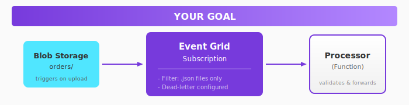
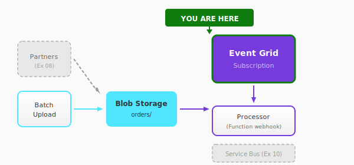

# Exercise 09a: Event Grid

## Overview

In this exercise, you'll configure **Event Grid** to automatically detect when order files are uploaded to blob storage and trigger processing. This enables the batch upload workflow in the CloudShop pipeline.

**Time:** 25-35 minutes (+ 15-20 minutes for challenges)

## What You'll Build



By the end, you'll have:
- A Storage Account with an `orders/` container
- An Azure Function that receives Event Grid webhooks
- Event Grid subscription that triggers on blob uploads
- (Challenge) Subject filtering and dead-letter configuration

## Architecture Context

This exercise connects the batch upload flow to the processing pipeline:



## Choose Your Path

### Infrastructure Approach

| Approach | Best For | Folder |
|----------|----------|--------|
| **Azure CLI** | Quick iteration, learning commands | [infrastructure/azure-cli/](infrastructure/azure-cli/) |
| **Bicep** | Infrastructure as Code, declarative | [infrastructure/bicep/](infrastructure/bicep/) |

### Code Language

| Language | Folder |
|----------|--------|
| **.NET** | [code/dotnet/](code/dotnet/) |

Each has `starter/` (with TODOs) and `complete/` (working solution) versions.

## Quick Start

Want to deploy everything at once and explore?

```bash
# 1. Configure environment
cp env.example.sh env.sh
# Edit env.sh with your unique suffix

# 2. Deploy everything
cd quickstart
./deploy-all.sh

# 3. Test the integration
cd ../test
./test-eventgrid.sh
```

## Step-by-Step Guide

### Step 1: Set Up Environment

```bash
# Copy and edit environment file
cp env.example.sh env.sh
nano env.sh  # Set UNIQUE_SUFFIX to your initials + numbers (e.g., "jd123")

# Load environment
source env.sh
```

### Step 2: Create Storage Account

```bash
# Create resource group
az group create --name $RESOURCE_GROUP --location $LOCATION

# Create storage account
az storage account create \
    --name $STORAGE_NAME \
    --resource-group $RESOURCE_GROUP \
    --location $LOCATION \
    --sku Standard_LRS

# Create orders container
az storage container create \
    --name orders \
    --account-name $STORAGE_NAME
```

### Step 3: Deploy the Function

Deploy the webhook handler:

```bash
cd code/dotnet/complete
func azure functionapp publish $FUNC_NAME
```

Or use the deploy script:
```bash
cd deploy
./deploy-code.sh dotnet complete
```

### Step 4: Create Event Grid Subscription

```bash
# Get storage account resource ID
STORAGE_ID=$(az storage account show \
    --name $STORAGE_NAME \
    --resource-group $RESOURCE_GROUP \
    --query id -o tsv)

# Create Event Grid subscription
az eventgrid event-subscription create \
    --name order-uploaded \
    --source-resource-id $STORAGE_ID \
    --endpoint "https://${FUNC_NAME}.azurewebsites.net/api/OrderUploaded" \
    --endpoint-type webhook \
    --included-event-types Microsoft.Storage.BlobCreated
```

### Step 5: Test the Integration

```bash
# Create and upload a test order
echo '{"orderId": "ORD-001", "customer": "Alice", "total": 99.99}' > order001.json

az storage blob upload \
    --account-name $STORAGE_NAME \
    --container-name orders \
    --name order001.json \
    --file order001.json

# Check function logs
az functionapp logs tail \
    --name $FUNC_NAME \
    --resource-group $RESOURCE_GROUP
```

You should see:
```
[Information] ORDER FILE UPLOADED
[Information] Subject: /blobServices/default/containers/orders/blobs/order001.json
[Information] Blob URL: https://stcloudshop.../orders/order001.json
```

## Validation Checklist

- [ ] Storage account and `orders/` container exist
- [ ] Function App is deployed and running
- [ ] Event Grid subscription is active
- [ ] Uploading a blob triggers the function
- [ ] Event details are logged correctly

Run the validation script:
```bash
cd validate
./check-all.sh
```

## Key Concepts

| Concept | Description |
|---------|-------------|
| **System Topic** | Auto-created topic for Azure service events |
| **Event Subscription** | Routes events to an endpoint |
| **Subject Filter** | Filter events by blob path pattern |
| **Event Types** | `BlobCreated`, `BlobDeleted`, etc. |

## Event Schema

When a blob is created, Event Grid sends:

```json
{
  "id": "unique-event-id",
  "eventType": "Microsoft.Storage.BlobCreated",
  "subject": "/blobServices/default/containers/orders/blobs/order001.json",
  "eventTime": "2024-01-15T10:30:00Z",
  "data": {
    "api": "PutBlob",
    "contentType": "application/json",
    "contentLength": 128,
    "url": "https://stcloudshop.../orders/order001.json"
  }
}
```

## Next Steps

- Complete the [Challenge](challenge.md) for advanced filtering and dead-letter
- Continue to [Exercise 09b: Event Hubs](../09b-event-hubs/README.md)

## Troubleshooting

<details>
<summary>Event Grid subscription fails to create</summary>

1. Ensure the Function App is deployed and responding
2. The webhook must return 200 for validation
3. Check the function URL is correct

</details>

<details>
<summary>Events not triggering the function</summary>

1. Verify the subscription is active: `az eventgrid event-subscription show --name order-uploaded --source-resource-id $STORAGE_ID`
2. Check the function is running: `az functionapp show --name $FUNC_NAME --query state`
3. Review function logs for errors

</details>

<details>
<summary>Validation handshake fails</summary>

1. Your function must handle `SubscriptionValidationEvent`
2. Return `{"validationResponse": "<code>"}` in response
3. Check the complete solution for reference

</details>
