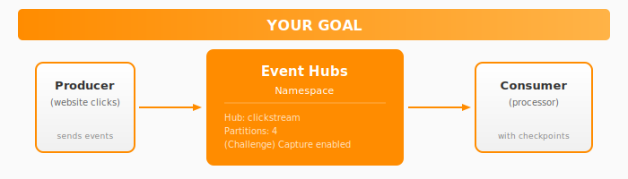
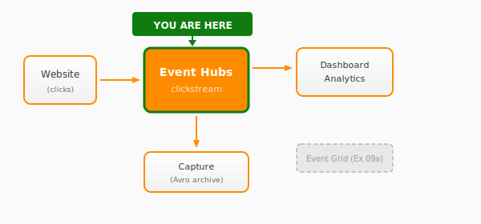

# Exercise 09b: Event Hubs

## Overview

In this exercise, you'll create an **Event Hubs** namespace to stream customer analytics data from the CloudShop website. This enables real-time clickstream analysis for the analytics team.

**Time:** 30-40 minutes (+ 20 minutes for challenges)

## What You'll Build



By the end, you'll have:
- An Event Hubs namespace with a `clickstream` hub
- A producer that sends click events
- A consumer with checkpoint-based processing
- (Challenge) Capture to archive events to blob storage

## Architecture Context

This exercise handles the analytics streaming workflow:



## Choose Your Path

### Infrastructure Approach

| Approach | Best For | Folder |
|----------|----------|--------|
| **Azure CLI** | Quick iteration, learning commands | [infrastructure/azure-cli/](infrastructure/azure-cli/) |
| **Bicep** | Infrastructure as Code, declarative | [infrastructure/bicep/](infrastructure/bicep/) |

### Code Language

| Language | Folder |
|----------|--------|
| **.NET** | [code/dotnet/](code/dotnet/) |

Each has `starter/` (with TODOs) and `complete/` (working solution) versions.

## Step-by-Step Guide

### Step 1: Set Up Environment

```bash
cp env.example.sh env.sh
nano env.sh  # Set UNIQUE_SUFFIX

source env.sh
```

### Step 2: Create Event Hubs Namespace

```bash
# Create resource group
az group create --name $RESOURCE_GROUP --location $LOCATION

# Create Event Hubs namespace (Standard tier required for Capture)
az eventhubs namespace create \
    --name $EVENTHUB_NAMESPACE \
    --resource-group $RESOURCE_GROUP \
    --location $LOCATION \
    --sku Standard

# Create the clickstream hub with 4 partitions
az eventhubs eventhub create \
    --name $EVENTHUB_NAME \
    --namespace-name $EVENTHUB_NAMESPACE \
    --resource-group $RESOURCE_GROUP \
    --partition-count 4 \
    --message-retention 1
```

### Step 3: Get Connection String

```bash
EVENTHUB_CONNECTION=$(az eventhubs namespace authorization-rule keys list \
    --namespace-name $EVENTHUB_NAMESPACE \
    --resource-group $RESOURCE_GROUP \
    --name RootManageSharedAccessKey \
    --query primaryConnectionString -o tsv)

echo "Connection String: $EVENTHUB_CONNECTION"
```

### Step 4: Create Checkpoint Storage

The consumer needs storage for checkpoints:

```bash
az storage account create \
    --name $STORAGE_NAME \
    --resource-group $RESOURCE_GROUP \
    --location $LOCATION \
    --sku Standard_LRS

az storage container create \
    --name checkpoints \
    --account-name $STORAGE_NAME
```

### Step 5: Send Events (Producer)

```bash
cd code/dotnet/complete
dotnet run producer --connection "$EVENTHUB_CONNECTION" --count 100
```

### Step 6: Receive Events (Consumer)

```bash
STORAGE_CONNECTION=$(az storage account show-connection-string \
    --name $STORAGE_NAME \
    --resource-group $RESOURCE_GROUP \
    --query connectionString -o tsv)

cd code/dotnet/complete
dotnet run consumer --connection "$EVENTHUB_CONNECTION" --storage "$STORAGE_CONNECTION"
```

You should see events arriving from each partition:
```
[Partition 0] Event received:
  Session: a1b2c3d4...
  User: user-42
  Page: /products/widget-001
  Action: view
```

## Validation Checklist

- [ ] Event Hubs namespace created (Standard tier)
- [ ] Hub with 4 partitions exists
- [ ] Producer sends events successfully
- [ ] Consumer receives events from all partitions
- [ ] Checkpoints are stored in blob container

Run the validation script:
```bash
cd validate
./check-all.sh
```

## Key Concepts

| Concept | Description |
|---------|-------------|
| **Partition** | Ordered sequence of events (4 = max 4 parallel consumers) |
| **Consumer Group** | Independent view of the event stream |
| **Checkpoint** | Tracks last processed position per partition |
| **Retention** | How long events are kept (1-90 days) |
| **Capture** | Auto-archive to blob storage in Avro format |

## Partitions Explained

```
                    Event Hubs: clickstream
                    ┌───────────────────────┐
    Producer ──────▶│  ┌─────┐ Partition 0  │──────▶ Consumer A
                    │  ├─────┤ Partition 1  │──────▶ Consumer B
                    │  ├─────┤ Partition 2  │──────▶ Consumer C
                    │  └─────┘ Partition 3  │──────▶ Consumer D
                    └───────────────────────┘
```

- Events are distributed across partitions (round-robin or by partition key)
- Each partition can have one active consumer per consumer group
- More partitions = more parallelism = higher throughput

## Next Steps

- Complete the [Challenge](challenge.md) to enable Capture for archiving
- Continue to [Exercise 10: Service Bus](../10-service-bus/README.md)

## Troubleshooting

<details>
<summary>Consumer not receiving events</summary>

1. Check events were sent: Look at producer output
2. Verify connection strings are correct
3. Ensure checkpoint container exists
4. Try consumer with `starting_position="-1"` to read from beginning

</details>

<details>
<summary>Events not evenly distributed across partitions</summary>

Without a partition key, events are round-robin distributed. To control distribution, set the partition key when sending events so that all events with the same key go to the same partition.

</details>

<details>
<summary>Checkpoint errors</summary>

1. Verify storage account connection string
2. Check `checkpoints` container exists
3. Ensure storage account firewall allows access

</details>
