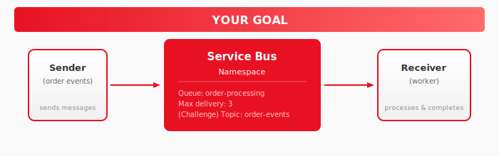
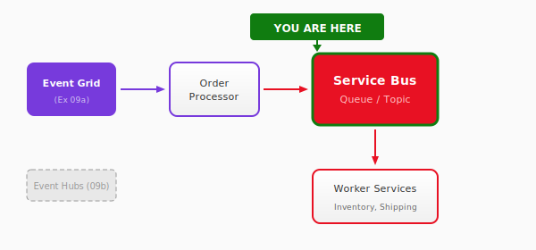

# Exercise 10: Service Bus

## Overview

In this exercise, you'll create a **Service Bus** queue for reliable order processing. Orders will be processed exactly once, even if services temporarily fail. This is the message backbone for the CloudShop order workflow.

**Time:** 30-40 minutes (+ 20 minutes for challenges)

## What You'll Build



By the end, you'll have:
- A Service Bus namespace with an `order-processing` queue
- A sender that publishes order messages
- A receiver that processes and completes messages
- (Challenge) Topics with filtered subscriptions for multi-service delivery

## Architecture Context

This exercise adds reliable messaging to the order processing flow:



## Choose Your Path

### Infrastructure Approach

| Approach | Best For | Folder |
|----------|----------|--------|
| **Azure CLI** | Quick iteration, learning commands | [infrastructure/azure-cli/](infrastructure/azure-cli/) |
| **Bicep** | Infrastructure as Code, declarative | [infrastructure/bicep/](infrastructure/bicep/) |

## Step-by-Step Guide

### Step 1: Set Up Environment

```bash
cp env.example.sh env.sh
nano env.sh  # Set UNIQUE_SUFFIX

source env.sh
```

### Step 2: Create Service Bus Namespace

```bash
# Create resource group
az group create --name $RESOURCE_GROUP --location $LOCATION

# Create Service Bus namespace (Standard tier for topics)
az servicebus namespace create \
    --name $SERVICEBUS_NAMESPACE \
    --resource-group $RESOURCE_GROUP \
    --location $LOCATION \
    --sku Standard

# Create order processing queue
az servicebus queue create \
    --name $QUEUE_NAME \
    --namespace-name $SERVICEBUS_NAMESPACE \
    --resource-group $RESOURCE_GROUP \
    --max-delivery-count 3 \
    --default-message-time-to-live P1D
```

### Step 3: Get Connection String

```bash
SERVICEBUS_CONNECTION=$(az servicebus namespace authorization-rule keys list \
    --namespace-name $SERVICEBUS_NAMESPACE \
    --resource-group $RESOURCE_GROUP \
    --name RootManageSharedAccessKey \
    --query primaryConnectionString -o tsv)

echo "Connection String: $SERVICEBUS_CONNECTION"
```

### Step 4: Send Test Messages

Use the Azure Portal Service Bus Explorer to send test messages:

1. Open Azure Portal → Service Bus namespace → Queues → `order-processing`
2. Click **Service Bus Explorer**
3. Click **Send messages**
4. Enter a test message body:
```json
{
  "orderId": "ORD-001",
  "customer": "Test Customer",
  "total": 99.99
}
```
5. Click **Send**

### Step 5: Receive Messages

In Service Bus Explorer:

1. Click **Peek from start** to view messages without removing them
2. Or click **Receive** to receive and complete messages

You should see your test message with its properties and body.

### Step 6: Check Dead-Letter Queue

Messages that fail 3 times go to the dead-letter queue:

```bash
az servicebus queue show \
    --name $QUEUE_NAME \
    --namespace-name $SERVICEBUS_NAMESPACE \
    --resource-group $RESOURCE_GROUP \
    --query "countDetails.deadLetterMessageCount"
```

## Validation Checklist

- [ ] Service Bus namespace created (Standard tier)
- [ ] Queue with max-delivery-count 3 exists
- [ ] Can send messages via Service Bus Explorer
- [ ] Can receive/peek messages via Service Bus Explorer
- [ ] Understand Complete vs Abandon behavior

Run the validation script:
```bash
cd validate
./check-all.sh
```

## Key Concepts

| Concept | Description |
|---------|-------------|
| **Queue** | Point-to-point messaging, one receiver |
| **Complete** | Remove message from queue (success) |
| **Abandon** | Return message to queue (retry later) |
| **Dead-letter** | Move to DLQ after max delivery attempts |
| **TTL** | Message expires if not processed in time |

## Message Lifecycle

```
    Sender                  Queue                     Receiver
      │                       │                          │
      │──── Send Message ────▶│                          │
      │                       │◀─── Receive Message ─────│
      │                       │                          │
      │                       │     [Processing...]      │
      │                       │                          │
      │                       │◀─── Complete ────────────│  ← Success
      │                       │     (removes message)    │
      │                       │                          │
      │                       │◀─── Abandon ─────────────│  ← Retry
      │                       │     (back to queue)      │
      │                       │                          │
      │                       │                          │
      │              ┌────────┴────────┐                 │
      │              │  Dead-Letter    │ ← After 3 fails │
      │              │    Queue        │                 │
      │              └─────────────────┘                 │
```

## Queue vs Topic

| Feature | Queue | Topic |
|---------|-------|-------|
| Receivers | One | Multiple subscriptions |
| Pattern | Point-to-point | Publish/Subscribe |
| Use case | Work distribution | Event fan-out |

## Next Steps

- Complete the [Challenge](challenge.md) for Topics with filtered subscriptions
- Continue to [Exercise 11: Application Insights](../11-app-insights/README.md)

## Troubleshooting

<details>
<summary>Messages stuck in queue</summary>

1. Check receiver is running and connected
2. Verify connection string is correct
3. Ensure receiver calls `complete_message()` after processing

</details>

<details>
<summary>Messages going to dead-letter immediately</summary>

1. Check for exceptions in message processing
2. Ensure message body is valid JSON
3. Review receiver logs for errors

</details>

<details>
<summary>Cannot create topic</summary>

Topics require Standard tier or higher. Check your namespace SKU:
```bash
az servicebus namespace show --name $SERVICEBUS_NAMESPACE --resource-group $RESOURCE_GROUP --query sku.name
```

</details>
