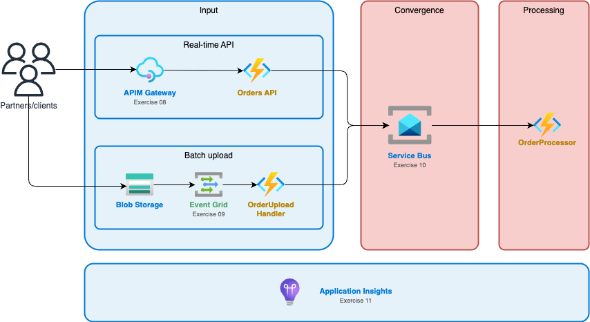

# Exercise 10: Service Bus

## Architecture



*You are here: Building the **Service Bus** queue - the reliable message backbone for order processing.*

## What You'll Build

- **Service Bus Namespace** - Standard tier for queues and topics
- **Orders Queue** - With dead-letter and retry configuration
- **Function App Connection** - Queue-triggered message processing

## Prerequisites

Complete [Exercise 08](../08-api-management/) first - you need the Function App.

## Choose Your Path

| Path | Description |
|------|-------------|
| **Learning** | Work through steps below, using guided scripts |
| **Quick Deploy** | Run `./quickstart/deploy-all.sh` |

## Learning Path

### Step 1: Configure Environment

```bash
cp env.example.sh env.sh
nano env.sh  # Set UNIQUE_SUFFIX to match Exercise 08
source env.sh
```

### Step 2: Deploy Infrastructure

Open [`infrastructure/azure-cli/guided/deploy.sh`](infrastructure/azure-cli/guided/deploy.sh) and work through Steps 1-4:

| Step | What You'll Create | Key Concept |
|------|-------------------|-------------|
| 1 | Service Bus Namespace | Messaging container (Standard tier) |
| 2 | Orders Queue | Dead-letter, max delivery count |
| 3 | Get Connection String | Shared access key |
| 4 | Configure Function App | Set connection string setting |

Fill in the `???` placeholders, uncomment each section, and run the script.

### Step 3: Deploy Function Code

```bash
cd code/dotnet
./deploy.sh
```

### Step 4: Test with Service Bus Explorer

1. Open Azure Portal → Service Bus namespace → Queues → `orders`
2. Click **Service Bus Explorer**
3. Click **Send messages**
4. Enter test message:
```json
{"orderId": "ORD-001", "customer": "Test Customer", "total": 99.99}
```
5. Click **Send**
6. Check function logs: `func azure functionapp logstream $FUNC_NAME`

## Validation

```bash
./validate/check-all.sh
```

## Key Concepts

| Concept | Description |
|---------|-------------|
| **Queue** | Point-to-point messaging, one receiver |
| **Complete** | Remove message from queue (success) |
| **Abandon** | Return message to queue (retry later) |
| **Dead-letter** | Move to DLQ after max delivery attempts |

## Message Lifecycle

```
Sender              Queue                   Receiver
  │                   │                        │
  │── Send Message ──▶│                        │
  │                   │◀── Receive ────────────│
  │                   │    [Processing...]     │
  │                   │◀── Complete ───────────│  ← Success
  │                   │                        │
  │                   │◀── Abandon ────────────│  ← Retry
  │           ┌───────┴───────┐                │
  │           │  Dead-Letter  │ ← After 3 fails│
  │           │    Queue      │                │
  │           └───────────────┘                │
```

## Next Exercise

Continue to [Exercise 11: Application Insights](../11-app-insights/) to add monitoring.

---

## Why Service Bus?

| Requirement | How Service Bus Solves It |
|-------------|--------------------------|
| Guaranteed delivery | At-least-once semantics |
| Order processing | FIFO with sessions |
| Multiple handlers | Topics with subscriptions |
| Failed message handling | Built-in dead-letter queue |

---

## Troubleshooting

<details>
<summary>Messages stuck in queue</summary>

1. Check receiver is running and connected
2. Verify connection string is correct
3. Ensure receiver calls `complete_message()` after processing

</details>

<details>
<summary>Messages going to dead-letter immediately</summary>

1. Check for exceptions in message processing
2. Ensure message body is valid JSON
3. Review receiver logs for errors

</details>

<details>
<summary>Cannot create topic</summary>

Topics require Standard tier or higher. Check your namespace SKU:
```bash
az servicebus namespace show --name $SERVICEBUS_NAMESPACE --resource-group $RESOURCE_GROUP --query sku.name
```

</details>
