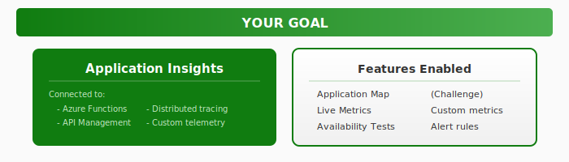
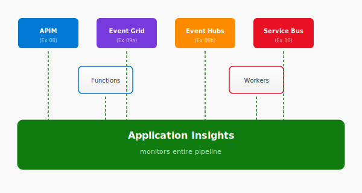

# Exercise 11: Application Insights

## Overview

In this exercise, you'll add **Application Insights** to monitor the entire CloudShop pipeline. You'll see distributed traces, set up availability tests, and track custom metrics. This completes the observability picture for the order processing system.

**Time:** 25-35 minutes (+ 20 minutes for challenges)

## What You'll Build



By the end, you'll have:
- Application Insights connected to your services
- Distributed tracing across the pipeline
- Application Map showing service dependencies
- (Challenge) Custom telemetry and alert rules

## Architecture Context

Application Insights monitors all services in the CloudShop pipeline:



## Choose Your Path

### Infrastructure Approach

| Approach | Best For | Folder |
|----------|----------|--------|
| **Azure CLI** | Quick iteration, learning commands | [infrastructure/azure-cli/](infrastructure/azure-cli/) |
| **Bicep** | Infrastructure as Code, declarative | [infrastructure/bicep/](infrastructure/bicep/) |

## Step-by-Step Guide

### Step 1: Set Up Environment

```bash
cp env.example.sh env.sh
nano env.sh  # Set UNIQUE_SUFFIX

source env.sh
```

### Step 2: Create Application Insights

```bash
# Create resource group
az group create --name $RESOURCE_GROUP --location $LOCATION

# Create Application Insights
az monitor app-insights component create \
    --app $APPINSIGHTS_NAME \
    --location $LOCATION \
    --resource-group $RESOURCE_GROUP \
    --application-type web

# Get connection string
AI_CONNECTION=$(az monitor app-insights component show \
    --app $APPINSIGHTS_NAME \
    --resource-group $RESOURCE_GROUP \
    --query connectionString -o tsv)

echo "Connection String: $AI_CONNECTION"
```

### Step 3: Connect Azure Functions

If you have a Function App from previous exercises:

```bash
az functionapp config appsettings set \
    --name $FUNC_NAME \
    --resource-group $RESOURCE_GROUP \
    --settings "APPLICATIONINSIGHTS_CONNECTION_STRING=$AI_CONNECTION"
```

### Step 4: Connect API Management (Optional)

If you deployed APIM in Exercise 08:

```bash
# Get instrumentation key
AI_KEY=$(az monitor app-insights component show \
    --app $APPINSIGHTS_NAME \
    --resource-group $RESOURCE_GROUP \
    --query instrumentationKey -o tsv)

# Create logger in APIM
az apim logger create \
    --resource-group $RESOURCE_GROUP \
    --service-name $APIM_NAME \
    --logger-id appinsights-logger \
    --logger-type applicationInsights \
    --instrumentation-key $AI_KEY
```

### Step 5: Generate Traffic

Send requests to trigger telemetry:

```bash
# If you have the Orders API
for i in {1..10}; do
    curl -s "https://${FUNC_NAME}.azurewebsites.net/api/orders" || true
    sleep 1
done
```

### Step 6: View Application Map

1. Open Azure Portal
2. Navigate to Application Insights → `ai-cloudshop-xxx`
3. Click **Application Map**
4. You should see connected services and their dependencies

### Step 7: Explore Key Features

In the Azure Portal, explore:

| Feature | Location | What to Look For |
|---------|----------|------------------|
| **Live Metrics** | Monitoring → Live Metrics | Real-time request rates, failures |
| **Transaction Search** | Investigate → Search | Find specific requests by ID |
| **Failures** | Investigate → Failures | Exception details, stack traces |
| **Performance** | Investigate → Performance | Response time percentiles |

## Validation Checklist

- [ ] Application Insights created
- [ ] Connection string available
- [ ] Function App connected (if exists)
- [ ] Telemetry visible in portal (may take a few minutes)

Run the validation script:
```bash
cd validate
./check-all.sh
```

## Key Concepts

| Concept | Description |
|---------|-------------|
| **Application Map** | Visual dependency graph of your services |
| **Live Metrics** | Real-time telemetry stream |
| **Distributed Tracing** | Follow requests across services |
| **Availability Tests** | Synthetic monitoring from global locations |
| **Custom Metrics** | Application-specific measurements |

## Telemetry Types

| Type | When to Use | Example |
|------|-------------|---------|
| **Request** | Incoming HTTP calls | API endpoint hits |
| **Dependency** | Outgoing calls | Database, storage, APIs |
| **Exception** | Errors and failures | Unhandled exceptions |
| **Trace** | Diagnostic logs | Debug information |
| **Custom Event** | Business events | Order placed, user signup |
| **Custom Metric** | Measurements | Processing time, queue depth |

## KQL Queries

Try these queries in **Logs**:

```kusto
// Recent requests
requests
| where timestamp > ago(1h)
| summarize count() by resultCode
| render piechart

// Slowest requests
requests
| where timestamp > ago(1h)
| top 10 by duration

// Failures with exceptions
requests
| where success == false
| join kind=inner exceptions on operation_Id
| project timestamp, name, resultCode, outerMessage
```

## Next Steps

- Complete the [Challenge](challenge.md) for custom telemetry and alerts
- Review all exercises completed in the CloudShop pipeline

## Troubleshooting

<details>
<summary>No telemetry appearing</summary>

1. Wait 3-5 minutes for data to appear
2. Verify connection string is correct
3. Check that the app is generating requests
4. Look for errors in Function App logs

</details>

<details>
<summary>Application Map is empty</summary>

1. Ensure services are connected to the same Application Insights
2. Generate some traffic to create dependencies
3. Wait for data ingestion (can take a few minutes)

</details>

<details>
<summary>Missing distributed traces</summary>

1. Ensure all services use the same instrumentation key
2. Verify W3C trace context headers are propagated
3. Check that sampling isn't filtering out traces

</details>
