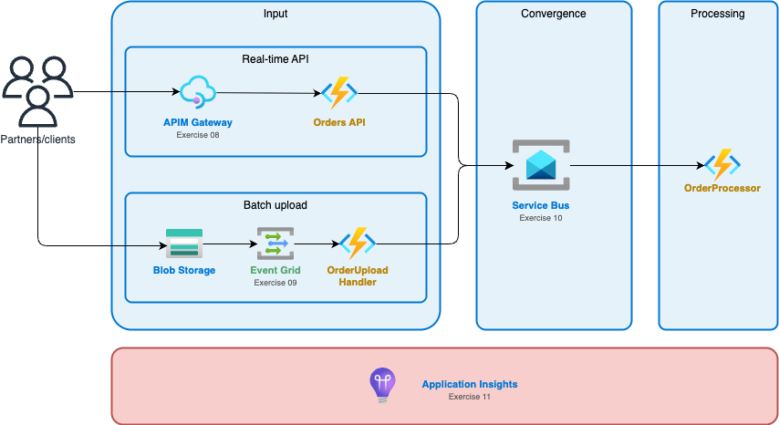

# Exercise 11: Application Insights

## Architecture



*You are here: Adding **Application Insights** - monitoring for your application code.*

## What You'll Build

- **Application Insights** - Telemetry for Functions and APIM
- **Function App Connection** - Automatic request/dependency tracking
- **APIM Logger** - API gateway request logging (optional)

> **Note:** Application Insights monitors **application code** (Azure Functions, API Management). Infrastructure services like Storage, Event Grid, and Service Bus have their own metrics in Azure Monitor.

## Prerequisites

Complete [Exercise 08](../08-api-management/) first - you need the Function App and APIM.

## Choose Your Path

| Path | Description |
|------|-------------|
| **Learning** | Work through steps below, using guided scripts |
| **Quick Deploy** | Run `./infrastructure/azure-cli/solution/deploy.sh` |

## Learning Path

### Step 1: Configure Environment

```bash
cp env.example.sh env.sh
nano env.sh  # Set UNIQUE_SUFFIX to match Exercise 08
source env.sh
```

### Step 2: Deploy Infrastructure

Open [`infrastructure/azure-cli/guided/deploy.sh`](infrastructure/azure-cli/guided/deploy.sh) and work through Steps 1-3:

| Step | What You'll Create | Key Concept |
|------|-------------------|-------------|
| 1 | Application Insights | Telemetry collection |
| 2 | Get Connection String | Required for SDK |
| 3 | Connect Function App | Auto-instrumentation |

Fill in the `???` placeholders, uncomment each section, and run the script.

### Step 3: Connect APIM (Optional)

```bash
./deploy/configure-apim.sh
```

### Step 4: Generate Traffic

```bash
# Send some requests to generate telemetry
for i in {1..10}; do
    curl -s "https://${FUNC_NAME}.azurewebsites.net/api/health" || true
    sleep 1
done
```

### Step 5: Explore in Portal

1. Open Azure Portal → Application Insights → `ai-cloudshop-xxx`
2. **Application Map** - See service dependencies
3. **Live Metrics** - Real-time telemetry
4. **Logs** - Run KQL queries

## Validation

```bash
./validate/check-all.sh
```

## Key Concepts

| Concept | Description |
|---------|-------------|
| **Application Map** | Visual dependency graph |
| **Live Metrics** | Real-time telemetry stream |
| **Distributed Tracing** | Follow requests across services |
| **Logs (KQL)** | Query telemetry with Kusto Query Language |

## KQL Queries

Try these in **Logs**:

```kusto
// Recent requests by status
requests
| where timestamp > ago(1h)
| summarize count() by resultCode
| render piechart

// Slowest requests
requests
| where timestamp > ago(1h)
| top 10 by duration

// Failures with details
requests
| where success == false
| join kind=inner exceptions on operation_Id
| project timestamp, name, resultCode, outerMessage
```

## Wrap Up

Congratulations! You've completed the CloudShop exercises:

- **API Gateway** (Exercise 08) - Secure entry point
- **Event Grid** (Exercise 09) - Event-driven batch processing
- **Service Bus** (Exercise 10) - Reliable message queuing
- **Application Insights** (Exercise 11) - Monitoring for Functions and APIM

---

## Troubleshooting

<details>
<summary>No telemetry appearing</summary>

1. Wait 3-5 minutes for data to appear
2. Verify connection string is correct
3. Check that the app is generating requests
4. Look for errors in Function App logs

</details>

<details>
<summary>Application Map is empty</summary>

1. Ensure services are connected to the same Application Insights
2. Generate some traffic to create dependencies
3. Wait for data ingestion (can take a few minutes)

</details>

<details>
<summary>APIM logger creation fails</summary>

The script uses REST API since `az apim logger` doesn't exist. Check:
1. APIM exists and is provisioned
2. Application Insights exists
3. You have proper permissions

</details>
